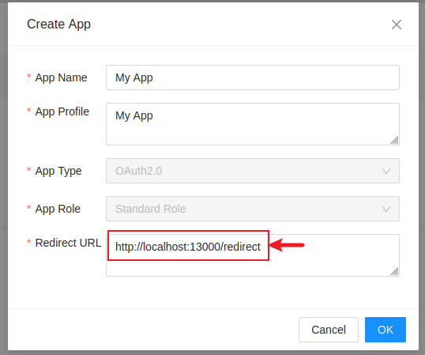
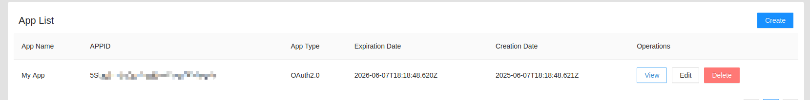
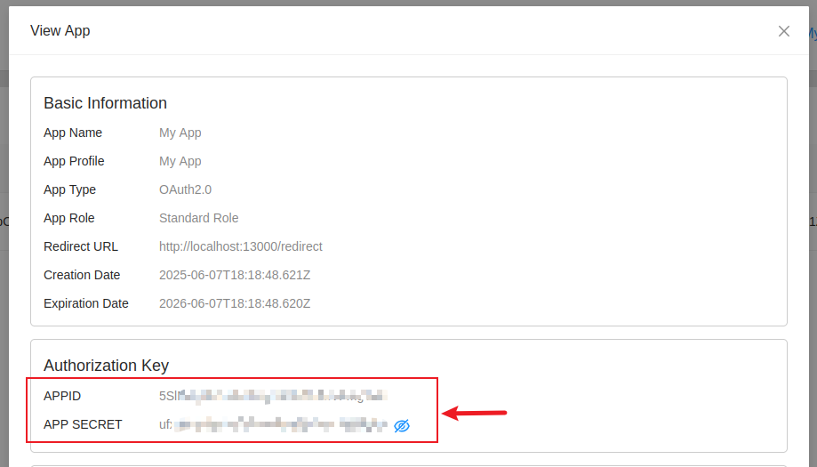

# eWeLink MCP Server

A Model Context Protocol (MCP) server that provides eWeLink API integration.

## Requirements
- Node.js v18 or higher
- eWeLink developer account

### 1. Create eWeLink Developer Account
1. Visit [eWeLink Developer Center](https://dev.ewelink.cc) and login.

2. Submit required information.

3. In Console page, create a App, fill in the redirect URL as shown below.
</a>

4. Finally, you can obtain the APPID and APP SECRET.
</a>
</a>

For more information, visit [DeveloperGuide](https://coolkit-technologies.github.io/eWeLink-API/#/en/DeveloperGuideV2).

### 2. Login
```bash
npx -y @991glasses/ewelink-mcp-server login
# Follow prompts to enter:
# - Your APPID
# - APP SECRET
# - Enter your eWeLink account in the pop-up login page
```

### 3. Configure MCP Server
```json
{
  "mcpServers": {
    "ewelink-mcp-server": {
      "command": "npx",
      "args": [
        "-y",
        "@991glasses/ewelink-mcp-server"
      ]
    }
  }
}
```

## License
This MCP server is licensed under the MIT License. This means you are free to use, modify, and distribute the software, subject to the terms and conditions of the MIT License. For more details, please see the LICENSE file in the project repository.